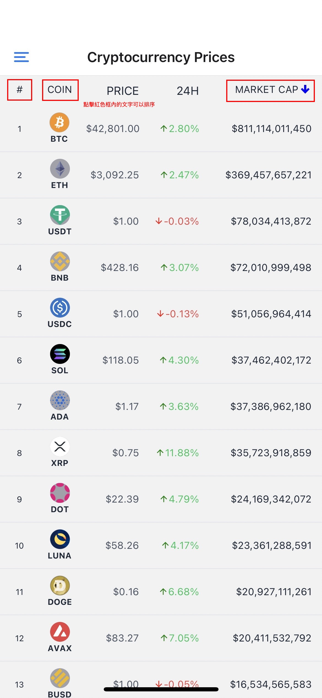

# Crypto App
[Project page](https://expo.dev/@sheng8366/crypto-app)

## Stack
- [React Native](https://reactnative.dev/) - ReactJS-based framework that can use native platform capabilities
- [Expo](https://expo.dev/) - Toolset for building and delivering RN apps
- [React Navigation(v6)](https://reactnavigation.org/) - Routing and navigation
- [NativeBase(v3)](https://nativebase.io/) - Themable component library

## Project structure

```
$PROJECT_ROOT
├── App.tsx        # Entry point
└── src
    ├── apis       # Request apis
    ├── screens    # Screen components
    ├── components # UI components
    ├── utils      # Custom hooks and helpers
    └── assets     # Image files
    
```

## How to dev

This project can be run from the Expo client app.

```sh
yarn
yarn start
```

## How to use

  - Click on the list header to sort
  - Slide to the bottom of the list to load more
